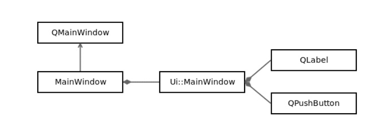
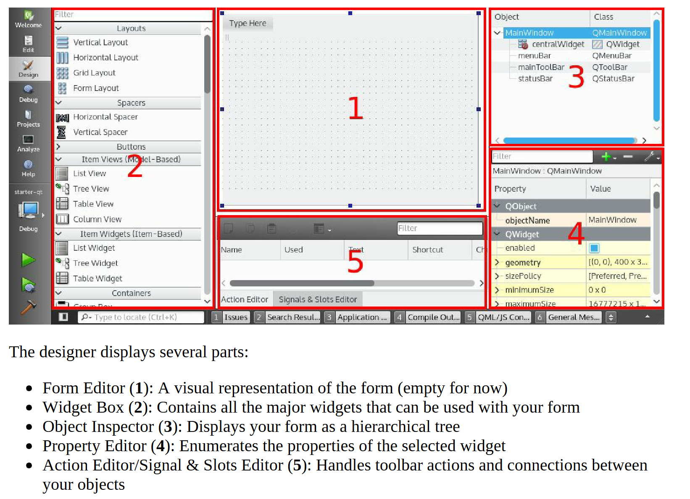

## Get Your Qt Feet Wet

### Qt project basic structure

设置默认文件命格式：Tools | Options... | C++ | File Naming | Lower case file names option

### MainWindow structure

MainWindow.h头文件解析：

```c++
#include <QMainWindow> 

// 前置声明，减少编译时间和避免循环依赖
namespace Ui { 
class MainWindow; 
} 
 
class MainWindow : public QMainWindow 
{ 
	// 允许定义自己的信号槽
    Q_OBJECT 
 
public: 
    // 定义父子关系，让qt帮助内存管理，删除父指针会递归删除子
    explicit MainWindow(QWidget *parent = 0); 
    ~MainWindow(); 
private: 
    // 通过ui与C++UI组件交互。ui被定义在ui_MainWindow.h文件*（MainWindow.ui的转译文件）
    Ui::MainWindow *ui; 
};
```

关系图：

MainWindow.cpp源文件分析：

```c++
#include "MainWindow.h"
// 头文件使用的前置声明，所以本源文件包含ui的头文件
#include "ui_MainWindow.h"

MainWindow::MainWindow(QWidget *parent)
    : QMainWindow(parent)
    , ui(new Ui::MainWindow)
{
	// 初始化所有被使用的ui组件（widgets）
    ui->setupUi(this);
}

MainWindow::~MainWindow()
{
    delete ui;
}
```

### Qt Designer interface

designer界面分析：

### Signals and slots

```c++
connect(sender, &Sender::signalName, receiver, &Receiver::slotName);
```

信号槽是一个灵活的消息交换机制：

1. signal是被对象发送的消息
2. slot是当信号被触发时会被调用的函数
3. connect指定哪个信号被连接到哪个槽上

Here is why you will love Qt signals and slots:

- A slot remains an ordinary function, so you can call it yourself
- A single signal can be linked to different slots
- A single slot can be called by different linked signals
- A connection can be made between a signal and a slot from different objects, and even
- between objects living inside different threads

### Custom QWidget

Click on File | New File or Project | Qt | Qt Designer Form Class

### Adding a task

model和界面应该分开，但是由于这个例子足够简单，所以不分开也可以ok的。

`ui->tasksLayout->addWidget(task)`会导致task的拥有权转移到tasksLayout的widget（centralWidget）上，layout不是qwidget所以不能作为父对象，父对象是拥有layout的qwidget。

创建动态界面：MainWindow设置一个layout，创建task后将其添加到layout中（使用layout的addWidget方法）。

### Using a QDialog

```c++
QString QinputDialog::getText( 
  QWidget* parent,  
      const QString& title,  
      const QString& label,  
      QLineEdit::EchoMode mode = QLineEdit::Normal,  
      const QString& text = QString(),  
      bool* ok = 0, ...)
```

### Distributing code responsibility

当task修改名字后，无需修改MainWindow，qt主循环会负责同步和更新。从而实现了task和MainWindow的0耦合。MainWindow是包含的task组件，所以task内部的修改，MainWindow无需考虑去更新，qt会自动给我更新的。

### Emitting a custom signal using lambdas

task组件被删除时，需要发送一个信号给MainWindow，从而让MainWindow删除这个组件。

使用lambda来处理槽函数需要比信号函数更多的参数的情况。如

```c++
connect(ui->removeButton, &QPushButton::clicked, [this] { 
        emit removed(this); 
    });
```

关于删除task这个逻辑处理可以学习一下：Task对象负责删除操作，所以当他删除时需要放松一个删除信号，这个信号需要有个这个task的地址，不然MainWindow不知道是哪个task要被删除，而this正好指向了当前这个task。

使用labmda的&捕获时，要注意对象生命周期的问题。

注意c++20之前[=]会自动捕获this，所以不要这么使用 [=, this]，如下代码就会有问题

```c++
#include <iostream>
#include <functional>

class MyClass {
    int id = 100;
public:
    std::function<void()> getLambda() {
        int local = 42;
        
        // C++17：危险！this被隐式捕获
        auto lambda = [=, this]() {  // 冗余但合法
            std::cout << "id: " << id          // 通过this访问 - 有悬挂风险！ 这里不是id的拷贝，而是直接访问的this->id
                      << ", local: " << local  // 值捕获 - 安全
                      << std::endl;
        };
        
        return lambda;  // lambda可能比对象生命周期更长！
    }
    
    ~MyClass() {
        std::cout << "MyClass destroyed\n";
    }
};

int main() {
    std::function<void()> func;
    
    {
        MyClass obj;
        func = obj.getLambda();  // lambda捕获了this指针
        func();  // 正常输出：id: 100, local: 42
    }  // obj被销毁！
    
    func();  // 未定义行为！this指针已失效
    return 0;
}
```

如果将指针从qt的父子对象中剔除，记得手动管理内存。

### Simplifying with the auto type and a range-based for loop

当用户task完成后，发出的信号名叫statusChanged而不是checkboxChecked，这样可以隐藏task的实现细节。

当类型比较明确，或则类型真的很长时（如迭代器）才使用auto，极可能减少使用。


## Dividing Your Project and Ruling Your Code

### Designing a maintainable project

设置可维护项目首先需要将其分解成多个清晰被定义的模块，常用方式为：将engine与ui分离。如qt项目，分解成core + desktop

让每一层都有单一职责

### Defining data classes

Album类没有包含vector<Picture>，好处：

1. 加载album无需潜在加载pictures
2. 用户无需考虑何时加载pictures？是否加载部分？还是加载全部？
3. 解耦后，用户在想要图片时，就知道他们必须显示加载图片。

### Storing your data in a database

数据库层会被多个地方使用，所以需要一个单一的入口点。这个单例类负责打开连接，然后把这个连接借给其他类。（也就是其他类引用它）

单例模式，但是将构造函数设置为protected，可以支持多态单例

使用前置声明避免用户包含不必要的依赖，我的库应该是一个黑盒子。

crud操作放到数据库管理类会导致类的急剧膨胀，所以每个data类需要有一个单独的database类（dao），负责对应的crud操作。

databasemanager包含一个public const dao，public为了方便调用，const为了避免用户破坏数据，副作用就是所有暴露的接口都必须是const方法。不用namespace的原因是，使用一个class可以保存一个database的引用，更加方便。

使用sqlquery的prepare()避免sql注入，而且代码可读性也更强

保持const正确性，从而告知用户这个参数是否会被修改。（引用和指针需要考虑，对于值传递其实无所谓）

如果dao太多，对于databasemanager也是一个冗余，可以考虑一个dao的抽象类，然后virtual bool init（）通过map<string, const dao>来访问dao和初始化dao。

### Protecting your code with a smart pointer

使用new构造，如果后续代码发生了异常，就可能导致没有delete。然而使用try - catch的话，会导致代码非常臃肿。其实上述的核心问题是：不确定谁拥有这个指针的拥有权。比如谁负责销毁指针，通过参数传递给函数时，是调用者拥有还是被调用者拥有指针。

解决方法：通过简单的模版语义显示确定指针的拥有权（智能指针）。

- unique_ptr：只有一个用户拥有拥有权
- shared_ptr：多个用户共享拥有权
- weak_ptr：用户没有拥有权

注意：智能指针分配在栈上，让其出作用域自动析构。

unique_ptr好处（其余类似）：

1. 用户无需担心指针的声明周期，智能指针的实现会自动处理好内存的分配和析构的。
2. 在编译时已经显示制定了指针的拥有权，同行开发者一眼就知道谁拥有这个指针的拥有权。
3. 由于c++支持操作符重载，所以用户可以如同使用普通指针一样使用智能指针。
4. 如果要转移拥有权，使用std::move即可。void bar(std::unique_ptr<Album>& barAlbum)就无需move因为这是引用，没有占用拥有权。而使用裸指针，则一般就是void bar(Album& barAlbum)，调用者需要使用bar(*album)。智能指针减少了解引用`*`·的使用
5. 轻量，额外开销小。

shared_ptr：

使用引用计数，当引用同一对象时加1，出作用域-1，计数为0则析构

weak_ptr：

显示指定当前是用户，而不是拥有者。如下：

```
void bar(std::weak_ptr<Album> barAlbum) 
{ 
   qDebug() << "Album name" << barAlbum->name(); 
} // ref counter = 1 
void foo() 
{ 
    std::shared_ptr<Album> album(new Album()); // ref counter = 1 
    bar(std::weak_ptr<Album>(album)); // ref counter = 1 
} // ref counter = 0
```

究极好处：

1. 处理悬挂指针
2. 对于不需要保留强引用的场景如缓存（不适用shared_ptr是为了避免生命周期延长），使用weak_ptr就可以知道对象是否被析构了。使用裸指针就无法确定指针是否有效，比如其他人delete了但是没有将指针置空，当前用户还以为是有效指针。

由于C++标准没有规定函数参数的求值顺序，如foo(new Album(), new Picture())，可能先new两个，在构造unqiue_ptr。这就会导致如果后者抛出异常，那么album就内存泄漏了。make_unique解决这个问题，这会强制创建一个unique_ptr再创建第二个。

注意：qt容器重载了拷贝运算符。所以unique_ptr的唯一性会被打破，要用vector<unique_ptr>

`std::unique_ptr<std::vector<std::unique_ptr<Album>>>`这种双重unique_ptr的使用场景：可能永远没有数据，那么这个写法比`<std::vector<std::unique_ptr<Album>>>`节省空间。比如可能长时间存放一些空的albums。vector本身一定会占用一些空间（内部有3个指针），而前者可以初始化为nullptr。vector无法完全清空内存，但是unique_ptr可以。

### Implementing the model

用户与数据库的直接连接会导致强耦合，比如当要切换另外一个存储层时将不得已修改界面代码。所以需要一个model层来与数据交互并以数据相关实现无关的方式暴露数据给用户。mvc就出现了。

mvc：

- model：请求数据并更新
- view：向用户展示数据
- controller：同时与model和view交互。想view填充正确的数据以及基于用户指令向model发送命令。

qt将controller与view结合为了简化实现，从而形成了model/view架构。为了允许编辑和视图自定义，引入了delegate。

使用一个缓存来避免每次查询数据库，一致性由model内部保证。

QModelIndex是一个抽象类，用于定位某个位置的数据，而无需关系底层实现，比如view只需要使用index查询数据，而无需关心index.row()关联了数据库还是vector。由于模型可能更改，所以index可能失效，古QModelIndex的生命周期很短。

数据被展示时往往是多个信息的聚合，所以通过role将每个数据与一个tag关联，从而让view知道显示的是那个类别的数据。

model的根索引永远是QModelIndex()。

PictureModel通过构造函数传入AlbumModel，然后进行信号槽连接。删除一个album，关联的pictures自动被删除。

构造没有初始化数据库所有的pictures到缓存，因为只有当album被选择我们才加载。

在代码强制指针拥有vector，即使是空的，可以避免代码中的空指针判断，虽然多一个空vector在堆上的开销。

## Conquering the Desktop UI

### Creating a GUI linked to a core shared library
